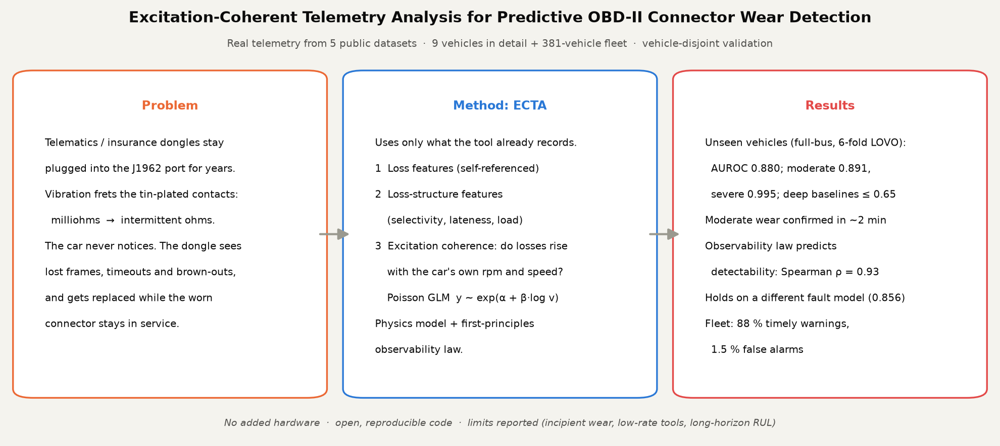
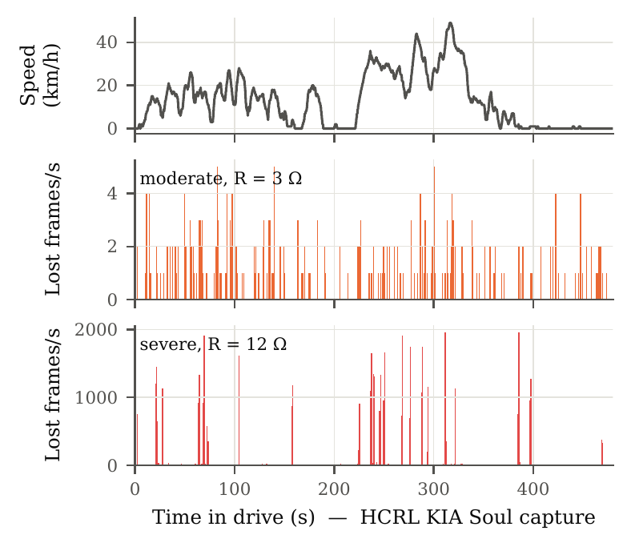
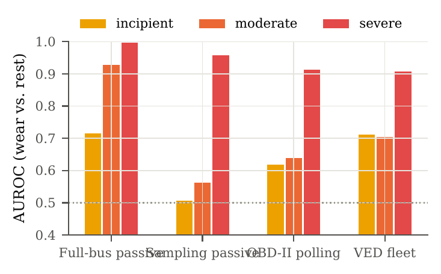
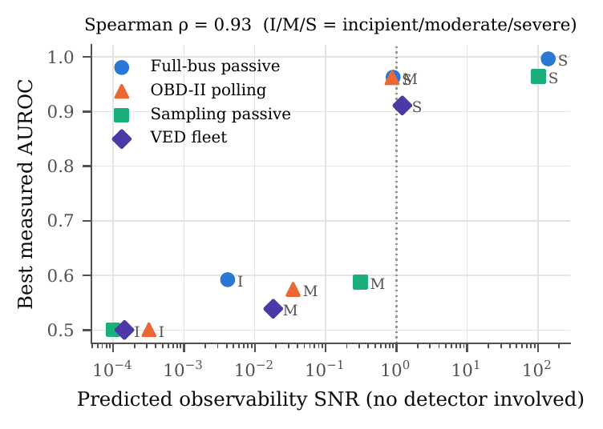
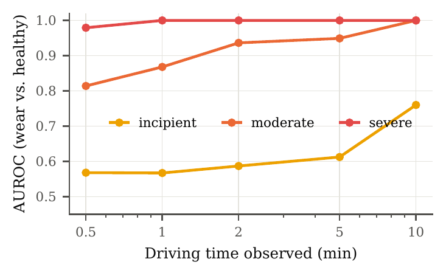
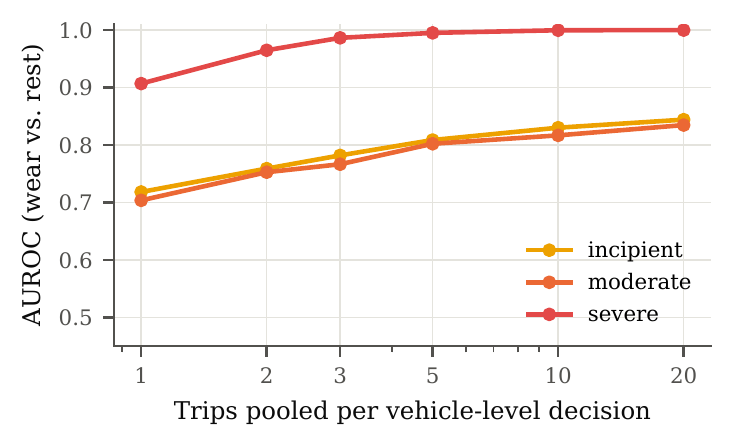
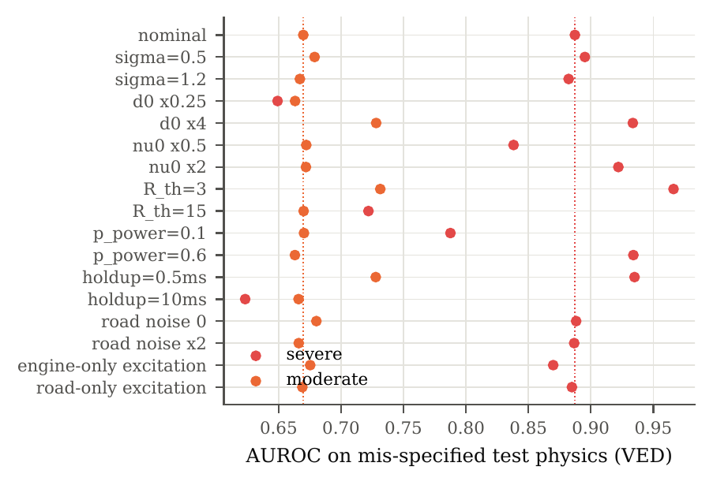
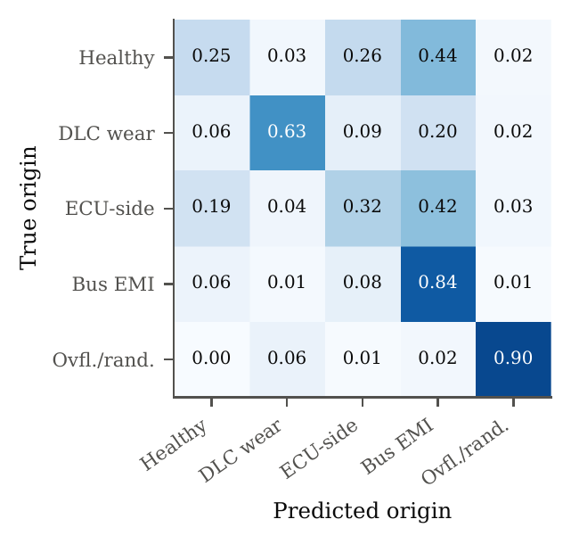
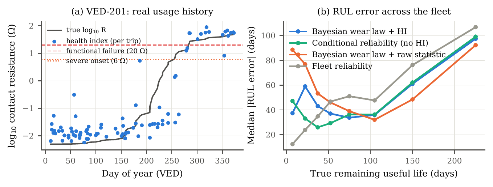
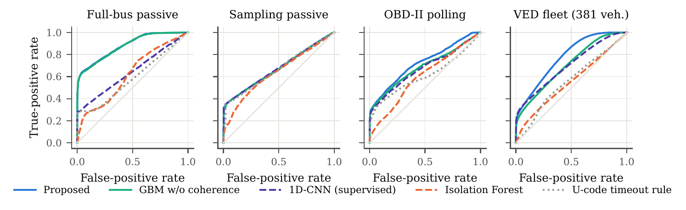

<div align="center">

# OCWD — Predictive OBD-II Connector Wear Detection

**Detect, attribute and forecast wear of the vehicle diagnostic connector using only the CAN / OBD-II telemetry the plugged-in device already records. No extra sensor needed.**

[](https://github.com/Bhargavteja-9779/FOAE-Fault-Origin-Attribution-Engine/actions/workflows/ocwd-tests.yml)




</div>

---

## Why this matters

Telematics, insurance and fleet dongles stay plugged into the SAE J1962 diagnostic connector (DLC) for years and draw power through it. Vibration slowly causes fretting corrosion of the tin-plated contacts until they open intermittently. The car never notices. The dongle sees lost frames, OBD-II timeouts and brown-out reboots, and the usual fix (replacing the device) leaves the worn connector in service.

**OCWD's key idea:** a fretted contact interrupts more often when it is shaken harder. Its loss rate therefore tracks the car's own engine and road excitation, which the device can read from the same data stream (rpm and speed). Logger overflow, ECU busy states and bus interference behave differently. **ECTA (Excitation-Coherent Telemetry Analysis)** turns that physics into features and a lightweight classifier.

## Highlights

| | |
|---|---|
| 🚗 **Real data** | 5 public datasets, 9 vehicles in detail plus the 381-vehicle VED fleet. That is 17.5 M full-bus frames and 8.24 M fleet records. |
| 🧪 **Strict evaluation** | Every result is vehicle-disjoint: leave-one-vehicle-out / GroupKFold, with vehicle-bootstrap 95 % confidence intervals. |
| 🎯 **Detection** | AUROC **0.880** on unseen vehicles. Moderate wear scores **0.891** and severe wear **0.995**. |
| 🧠 **Beats deep learning** | 1D-CNN 0.646, LSTM-AE 0.631, Transformer 0.641 (p ≤ 0.001). |
| ⏱ **Fast** | Moderate wear is confirmed after **~2 min** of driving (AUROC 0.94). |
| 🔕 **Few false alarms** | **0 per hour** of real healthy driving at 90 % severe-wear detection. |
| 📈 **Predictive** | Across the fleet, 88 % of warnings arrive in time, with a 1.5 % false-alarm rate (Bayesian, censoring-aware RUL). |
| 📐 **Explained** | An analytical observability law predicts measured detectability (Spearman ρ = 0.93). |
| 🔌 **Edge-ready** | Features take ~23 ms per 30-s window (58 k frames). The model is a 1.3 MB tree ensemble. |

## Results

### Detection on unseen vehicles (AUROC, wear vs. healthy + all confounders)

| Method | Full-bus passive<br><sub>6 vehicles</sub> | Sampling passive<br><sub>3 vehicles</sub> | OBD-II polling<br><sub>3 vehicles</sub> | VED fleet<br><sub>381 vehicles</sub> |
|---|:-:|:-:|:-:|:-:|
| **ECTA (ours)** | **0.880** | **0.675** | **0.723** | **0.775** |
| ECTA without coherence features | 0.878 | 0.674 | 0.686 | 0.704 |
| Loss features only | 0.768 | 0.673 | 0.670 | 0.672 |
| 1D-CNN (supervised) | 0.646 | 0.677 | 0.673 | 0.701 |
| Transformer (supervised) | 0.641 | 0.665 | 0.665 | 0.590 |
| LSTM autoencoder | 0.631 | 0.651 | 0.548 | 0.554 |
| Isolation Forest | 0.622 | 0.637 | 0.599 | 0.551 |
| One-class SVM | 0.596 | 0.658 | 0.603 | 0.541 |
| Loss-rate threshold | 0.653 | 0.667 | 0.579 | 0.567 |

Low-rate tools (sampling, polling) catch severe wear in one window (0.96 / 0.89). For earlier stages they need multi-trip pooling, which brings severe wear to a **vehicle-level AUROC of 0.999 after 10 trips**. These limits are reported on purpose rather than hidden.

### Wear stages and confounders (ECTA, full-bus)

| Wear stage vs. healthy | AUROC | | Wear vs. confounder | AUROC |
|---|:-:|---|---|:-:|
| Incipient | 0.555 | | ECU-side intermittent | 0.949 |
| Moderate | **0.891** | | Bus EMI | 0.979 |
| Severe | **0.995** | | Logger overflow | 0.977 |

Per held-out vehicle: 0.869 – 0.921.

### Robustness

| Test | Result |
|---|---|
| Trained on the Poisson fault model, tested on a structurally different **Markov-chatter** model | 0.856 (severe 0.999) |
| 16 deliberate physics-parameter mis-specifications | full-bus AUROC stays in 0.84 – 0.95; severe ≥ 0.97 |
| Window length 10 / 30 / 60 s | 0.824 / 0.879 / 0.911 |
| 7 hyperparameter configurations | ±0.004 (full-bus), ±0.015 (VED) |
| Coherence features against bus EMI (VED) | 0.947 vs. 0.737 without them |

### Figures

<table>
<tr>
<td align="center"><br><sub>Real excitation drives contact interruptions</sub></td>
<td align="center"><br><sub>Detectability by wear stage and tool class</sub></td>
</tr>
<tr>
<td align="center"><br><sub>Observability law vs. measured AUROC (ρ = 0.93)</sub></td>
<td align="center"><br><sub>Time to detect on full-bus data</sub></td>
</tr>
<tr>
<td align="center"><br><sub>Multi-trip evidence pooling (VED)</sub></td>
<td align="center"><br><sub>16 physics mis-specifications</sub></td>
</tr>
<tr>
<td align="center"><br><sub>5-class fault attribution (full-bus)</sub></td>
<td align="center"><br><sub>Fleet remaining-useful-life forecasting</sub></td>
</tr>
</table>

<p align="center"><br><sub>ROC curves on unseen vehicles, all four corpora</sub></p>

## How it works

```
 real CAN / OBD-II capture ──► decode rpm + speed ──► vibration excitation v(t)
                                                          │
         physics-informed fretting model (wear law, Poisson / Markov interruptions,
         brown-out, tool-specific telemetry effects) + 4 realistic confounders
                                                          │
                                                          ▼
  window (30 s) ──► features ─┬─ loss            (self-referenced frame / response loss)
                              ├─ structure       (ID selectivity, lateness, bus load)
                              └─ coherence       (Poisson GLM: does loss rise with excitation?)
                                                          │
                                                          ▼
                     LightGBM ──► wear score + 5-class attribution ──► trip pooling ──► RUL
```

**What is real and what is modelled.** The healthy telemetry, the excitation and the fleet usage histories are all real and never altered. The connector fault is injected by a physics-informed model, because no public dataset of naturally worn J1962 connectors exists. The detector never sees model internals. Generalization to a different fault process and to mis-specified constants is tested explicitly (see Robustness above).

## Quick start

```bash
git clone https://github.com/Bhargavteja-9779/FOAE-Fault-Origin-Attribution-Engine.git
cd FOAE-Fault-Origin-Attribution-Engine
pip install -r ocwd/requirements.txt

make test          # 14 unit tests, no data required (~20 s)
make data          # download the 5 public datasets (~5 GB)
make reproduce     # regenerate every result and figure (~4-5 h, CPU only)
```

Use the feature extractor on your own capture:

```python
from ocwd.features import passive_features

# t: frame timestamps (s), can_id: arbitration IDs, rpm/speed: decoded excitation signals
x = passive_features(t, can_id, t0=0.0, W=30.0, rpm=rpm, speed=speed)
# -> dict of 25 loss / structure / excitation-coherence features for one 30-s window
```

## Datasets

| Corpus | Dataset | Vehicles | Size |
|---|---|---|---|
| Full-bus passive | [can-train-and-test](https://bitbucket.org/brooke-lampe/can-dataset), [HCRL Car-Hacking](https://github.com/JehadAlyateem/Car-Hacking-Dataset), [CAN-MIRGU](https://github.com/sampathrajapaksha/CAN-MIRGU) | Chevrolet Impala, Traverse, Silverado; Subaru Forester; KIA Soul; +1 | 2.68 h · 17.5 M frames |
| Sampling passive | [CANmodes](https://github.com/Asr-roque/canmodes-datasets) (RAW) | GM Cruze, Ford Fiesta, VW Gol | 10.65 h |
| OBD-II polling | CANmodes (OBD) | same 3 | 9.03 h |
| Fleet polling | [VED](https://github.com/gsoh/VED) | 381 | 11 277 trips · 8.24 M records |

`ocwd/get_data.sh` downloads and unpacks everything into `data/raw/` (override with `OCWD_DATA`). Raw data is never committed.

## Repository structure

```
ocwd/                     ← main project
├── loaders.py            dataset parsers, timestamp repair, session splitting, de-duplication
├── signals.py            per-vehicle rpm / speed decoders
├── physics.py            wear law, excitation, Poisson & Markov interruptions, confounders
├── scenarios.py          paired real / faulted window generation (5 classes, 3 wear stages)
├── features.py           loss, structure and excitation-coherence features
├── models.py             ECTA + baselines (IF, OC-SVM, thresholds, 1D-CNN, LSTM-AE, Transformer)
├── ved.py                fleet trips, exposure, wear trajectories
├── experiments/          one script per result (build, evaluate, robustness, prognosis, …)
├── results/              every reported number, as JSON
├── figures/              every figure, as PDF
├── tests/                unit tests (run in CI)
└── docs/                 project guide, git guide
assets/                   README images
foae/  tests/  docs/      FOAE: earlier fault-origin attribution research (see foae/README.md)
paper/                    LaTeX manuscript and supplementary material
```

## Reproducibility

* Fixed seeds (3 per experiment); hyperparameters were frozen before evaluation and are the same on every corpus.
* All splits are by vehicle, so no vehicle appears in both training and test.
* `ocwd/results/*.json` holds the exact numbers shown above. `python -m ocwd.experiments.figures` rebuilds every figure from them.
* CPU only. No GPU is needed.

## Limitations

Incipient wear is not detectable from a single window. Moderate wear is out of reach for low-rate polling tools without pooling over trips. Months-ahead RUL is not achieved for polling tools. Telling a DLC fault from an ECU-connector fault needs multi-ECU visibility. The next step is validation on naturally worn connectors; see `docs/bench_setup.md`.

## Team

**P N Bhargav Teja · Lanka Sree Chathurya · K Arun Reddy · Ragavan K**
School of Computer Science and Engineering, Vellore Institute of Technology (VIT)

Related to Indian Patent Application **202641074361**, *"Predictive OBD-II Connector Wear Detection Using CAN Telemetry Analysis"*.

## Citation

If you use this work, please cite it via the [`CITATION.cff`](CITATION.cff) file (GitHub: *Cite this repository*).

## License

Copyright © 2026 the authors. All rights reserved. See [LICENSE](LICENSE).
